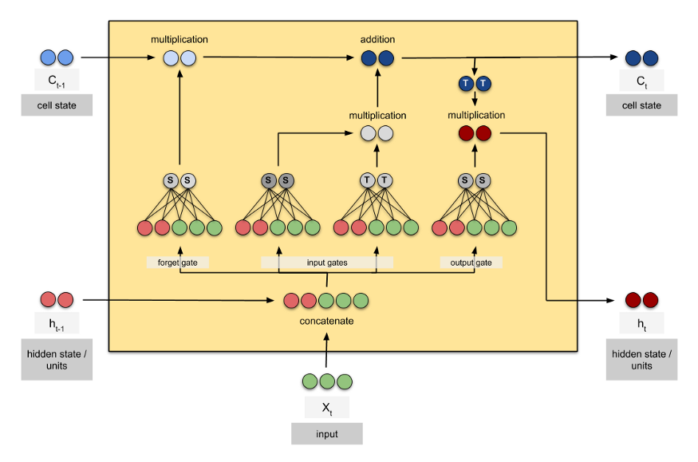

# rnn_practical

## What is RNN ? 

RNN stands for recurrent neural netowrk which takes sequential data as input and predict another sequence or a value.

## What is rnn for ?

* Natural Language Processing
* Time Series Prediction
* Machine Translation
* Speech Recognition
* Speech Synthesis

### How many parameters in a LSTM?

*num_paras* = *num_gates* x (*length_hidden* x (*length_hidden*+*length_input*)) + *num_gates* x *length_hidden*

In the case of above simplified hidden and input,

*num_paras* = 4 x (2 x (2+3)) + 4 x 2 = 48

[The original answer](https://datascience.stackexchange.com/questions/10615/number-of-parameters-in-an-lstm-model)
